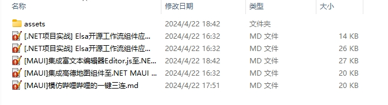
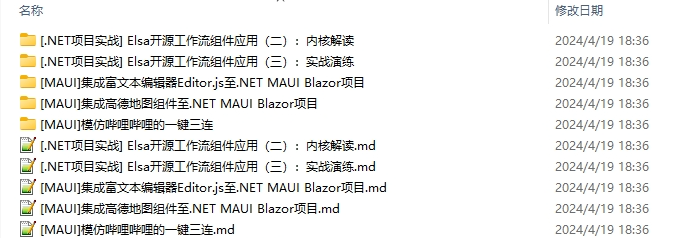

# BlogTool

使用Hexo风格的Markdown格式化，整理与归档图片的工具。

## 介绍

根据指定的Hexo[模板(Scaffold)](https://hexo.io/zh-cn/api/scaffolds) 批量将Markdown文件格式化，并将Markdown编辑插入的图片保存到本地。

## 特点


1. 支持MetaWeblog协议，本地Markdown文件
2. Hexo模板头处理和常用标签处理
3. 支持图片处理
    * 图片保存为内嵌Base64编码
    * 图片保存为[资源文件夹](https://hexo.io/zh-cn/docs/asset-folders#%E6%96%87%E7%AB%A0%E8%B5%84%E6%BA%90%E6%96%87%E4%BB%B6%E5%A4%B9)
    * 图片保存为[标签插件](https://hexo.io/zh-cn/docs/asset-folders#%E7%9B%B8%E5%AF%B9%E8%B7%AF%E5%BE%84%E5%BC%95%E7%94%A8%E7%9A%84%E6%A0%87%E7%AD%BE%E6%8F%92%E4%BB%B6)
    * 自定义图片文字水印（支持：PNG、JPG、Webp、Gif、Tiff、BMP）
    * 图片压缩（支持：PNG、JPG、Webp、Tiff），转换格式
4. 支持Ai生成内容
    * Ai 生成文章摘要
    * [Todo] Ai 生成标签列表
    * [Todo] Ai 生成文章封面图
    

## 更新内容

|  Date  |  Version   | Content                                                                                         |
| :----: | :--------: | :---------------------------------------------------------------------------------------------- |
| V0.1.0 | 2024-4-22  | 初始版本                                                                           
| V0.2.0 | 2024-5-3  | 完成本地获取Markdown文件   
| V0.2.1 | 2024-5-11  | 修复错误  
| V0.3.0 | 2024-8-22  | 添加Ai生成文章摘要功能  

## 配置

支持基于JSON配置文件和命令行参数配置。

### 配置文件


默认的配置文件`appsettings.json`内容如下:

```JSON
{
  "HexoPath": "./", //指定一个Hexo的根目录，其中必须包含scaffolds模板Markdown文件【可被-x参数覆盖】
  "OutputPath": "./source/_posts", //指定一个路径，作为Markdown和图片的导出目标，指定后会覆盖配置【可被-o参数覆盖】
  "SkipFileWhenException": true, //是否跳过处理异常的文件 true：跳过该文件，继续处理其它文件 false：抛出异常，终止处理
  "AssetsStore": {
    "AddWatermark": false, // 是否添加水印
    "CompressionImage": false, //是否压缩图片
    "SubPath": ".", //图片于输出子目录
    "Image": {
      "SkipNotSupportFormat": true, // 遇到不支持的图片类型是否跳过，否则就抛异常终止
      "WatermarkText": "InCerry", // 水印文字
      "WatermarkFontSize": 30, // 水印文字大小，如果图片小于文字大小，那么会缩放
      "WatermarkFont": "Microsoft Yahei", // 使用的字体类型，默认使用微软雅黑，Mac和Linux用户可自行配置系统安装的字体
      "WatermarkFontColor": "#FFF", // 字体颜色
      "CompressionLevel": "Low", // 压缩级别，级别越高大小越小，质量就越低，级别从低到高为：Low Medium High
      "ConvertFormatTo": "jpg" // 是否转换格式，支持一些常见的图片格式，如果不想转换，填null即可 如："ConvertFormatTo": null
    }
  },

  //for cnblogs
  "GetMarkdown": {
    "MetaWeblog": {
      "MetaWeblogURL": "https://rpc.cnblogs.com/metaweblog/jevonsflash", // MetaWeblog地址
      "Username": "jevonslin", //用户名 - 替换成你自己的用户名
      "Password": "9B5BAC9F20931E93EB3F39EF329001C0604ED59808E5656CDB1FA1ED85D7881C" //密码 - 替换成你自己的密码
    },
    // for oschina
    //"MetaWeblog": {
    //      "MetaWeblogURL": "https://my.oschina.net/action/xmlrpc/jevonsflash",
    //      "BlogURL": "https://my.oschina.net/blog",
    //      "Username": "jevonslin",
    //      "Password": "9B5BAC9F20931E93EB3F39EF329001C0604ED59808E5656CDB1FA1ED85D7881C"
    //},
    "Local": {
      "Path": ".", //获取Markdown文件的本地路径
      "Recursive": "false" //是否递归获取
    },

    "ReadMorePosition": 5, //<!-- more -->标签所在的行数，设置-1时将不添加此标签
    "RecentTakeCount": 1, //获取最近文件数,
    "Aigc": {
      "Target": "Description,Tag", // Ai 内容生成目标，可选Description,Tag，用英文逗号隔开
      "Provider": "DashScope", // Ai 内容生成提供者
      "ApiKey": "sk-00000000000000000000000000000000" //Ai 内容生成密钥 - 替换成你自己的密钥
    }
  },
  "MarkdownProvider": "MetaWeblog", //Markdown内容提供者，值为MetaWeblog, Local【可被-m参数覆盖】
  "AssetsStoreProvider": "Local" //图片存储方式，值为Embed, Local, Hexo-Asset-Folder, Hexo-Tag-Plugin【可被-a参数覆盖】
}
```

### 命令行参数

参数列表:

| 参数  |    含义     | 用法                                                                                                                                                                                                  |
| :---: | :---------: | :---------------------------------------------------------------------------------------------------------------------------------------------------------------------------------------------------- |
|  -x   | Hexo | 指定一个Hexo的根目录，其中必须包含scaffolds模板Markdown文件, 指定后会覆盖配置                                                                                
|  -o   |   Output    | 指定一个路径，作为Markdown和图片的导出目标，指定后会覆盖配置 |
|  -r   |   RecentTakeCount    | 获取最近Markdown文件数  
|  -m   |   MarkdownProvider    | 值为`metaweblog`, `local`, 指定后会覆盖配置                                                                                                                                                         |
|  -a   | AssetsStoreProvider | 值为`embed`, `local`, `hexo-asset-folder`, `hexo-tag-plugin`, 指定后会覆盖配置                                                                                                                                                         |
|  -w   |  WaitAtEnd  | 指定时，程序执行完成后，将等待用户输入退出                                                                                                                                                            |
|  -h   |    Help     | 查看帮助       


## 快速开始

### 准备你Hexo博客

1. 在磁盘上（如`D:\Project`）创建工作目录，使用[hexo-cli](https://hexo.io/zh-cn/docs/commands.html)创建项目

```
mkdir -p D:\Project 
cd D:\Project
hexo init blog
```


2. 下载BlogTool到你的Hexo项目根目录

https://github.com/jevonsflash/BlogTool/raw/master/BT/blogtool.exe

3. 用Markdown格式写几篇博客，因为HexoPath默认配置为`./`所以你的`.md`文件可以暂时保存在Hexo项目根目录

4. 在当前目录下运行

```
blogtool.exe -r 1 -a local
```
5. 执行Hexo调试三连或者部署三连，就可以看到效果了

```
hexo clean
hexo generate
hexo deploy

```


## 示例


为方便演示，我用自己的博客演示，从代码仓库下载我的博客Hexo项目

```
mkdir -p D:\Project 
cd D:\Project
git clone https://github.com/jevonsflash/blog.git blog
```


### Sample1：图片保存在本地assets文件夹


```
blogtool.exe -r 5 -a local -x D:\Project\blog\ -o D:\Project\blog\source\_posts
```




### Sample2：图片保存为标签插件

```
blogtool.exe -r 5 -a hexo-asset-folder -x D:\Project\blog\ -o D:\Project\blog\source\_posts
```





Markdown 中的图片修改为``格式


## 可扩展性

BlogTool默认提供`LocalMarkdownProvider`与`MetaWeblogMarkdownProvider`两个Markdown内容提供者

你可以自己定义一个Markdown内容提供者，比如从你的网盘，Ftp或第三方Api获得Markdown内容。

下面演示如何扩展一个通过传入文本来提供Markdown内容：


```
public class TextMarkdownProvider : MarkdownProvider
{
    public override ICollection<IMarkdown> GetMarkdowns(GetMarkdownOption option, params object[] objects)
    {
        var markdowns = new List<IMarkdown>();
        var p = objects[0] as dynamic;
        markdowns.Add(new PostInfo()
        {
            Categories = p.Category,
            Title = p.Title,
            Description = p.Content,
            DateCreated = DateTime.Now,
        });


        return markdowns;
    }
}
```

使用:


```
creator.SetMarkdownProvider(getMarkdownOption, new TextMarkdownProvider(), new { Title = title, Content = content new List<string>(){"TagA","TagB"}});
var mds = creator.Create(objects);
```


## Todo:

- [x] 本地Markdown导入
- [x] WPF界面
- [ ] 图床存储图片
- [ ] AIGC 内容提取


## 已知问题

无

## 作者信息

作者：林小

邮箱：jevonsflash@qq.com


## License

The MIT License (MIT)
